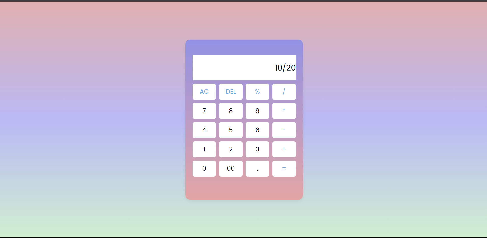

# CODSOFT-TASK-3
<h1 align="center"> 📱TASK-3:CALCULATOR</h1>
 <ul align="center"> <li><h2> created responsive calculator for performing addition substraction multiplication and addition using HTML, CSS & JS   
    
 </h2>
 </li>
 </ul>
